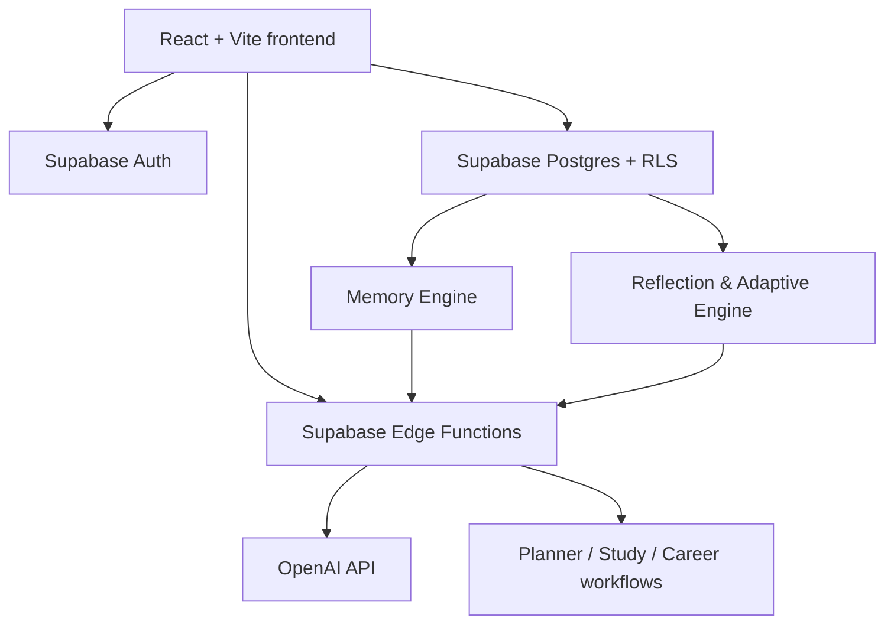

# StudentOS AI

> An adaptive AI operating system that helps students turn academic, career, and project ambitions into calm, executable progress.

StudentOS AI brings planning, study preparation, career readiness, goal tracking, and reflection into one intelligent workspace. It learns from completed work, explains its recommendations, and reshapes future plans around the student’s real capacity.

## The problem

Students usually manage coursework, applications, portfolios, deadlines, and habits in disconnected tools. Generic schedules fail because they do not account for changing workload, energy, or execution history. StudentOS AI closes this gap with a single, adaptive command center.

## What makes it different

- **Adaptive, not static:** planning context includes historical completion, skipped work, and habit insights.
- **Explainable AI:** coaching, predictions, and recommendations state the evidence behind them.
- **One workspace:** study, career, projects, goals, and productivity use the same source of truth.
- **Secure by default:** every workspace route requires a verified Supabase session and is scoped by RLS.

## Highlights

| Area | Capabilities |
| --- | --- |
| Planner | Streaming AI roadmap, workload balancing, priority matrix, risks, and success metrics |
| Study | Subjects, exam confidence, personalised study plans |
| Career | Placement roadmap, internship goals, applications, and skill readiness |
| Reflection | Weekly reviews, monthly analytics, habit learning, coaching, and predictions |
| Memory | Long-lived profile, preferences, planner history, and AI context |
| Experience | Responsive shadcn-style UI, Framer Motion, dark mode, and loading/error states |

## Architecture



```text
React + Vite UI
  ├─ Supabase Auth ─────────────── authenticated sessions
  ├─ Supabase Postgres + RLS ───── workspace, memory, reflections
  └─ Supabase Edge Functions ───── secure AI boundary
       └─ OpenAI API ───────────── planner, study, career, goal advice

Frontend services: Planner | Memory | Reflection | Career | Study
```

The browser reads and writes only the signed-in user’s data through RLS. AI requests include a compact, relevant workspace context and are sent to Edge Functions; the OpenAI key remains server-side. Reflection services derive analytics from tasks and goals, persist their evidence, then feed it back into the Planner.

## Stack

- **Frontend:** React 19, TypeScript, Vite — fast, typed SPA development.
- **UI:** Tailwind CSS, Radix primitives, CVA, Lucide — accessible, consistent interface primitives.
- **Motion:** Framer Motion — lightweight, respectful micro-interactions.
- **Backend:** Supabase Edge Functions (Deno) — colocated, deployable server-side AI boundary.
- **Data/Auth:** Supabase Postgres, Row Level Security, Supabase Auth — secure multi-user data without a separate API server.
- **AI:** OpenAI API through Edge Function secrets — no browser-exposed API key.

> There is no FastAPI backend in the current implementation. A FastAPI service can be added later behind the Edge Function boundary for workloads such as queues, vector retrieval, or custom ML.

## Quick start

```bash
git clone <your-repository-url>
cd studentos-ai
npm install
cp .env.example .env.local
npm run dev
```

Open the URL printed by Vite and sign in with a Supabase Auth account. Configure Supabase before running the application.

### Environment

See [.env.example](.env.example). Never place `GEMINI_API_KEY` in a `VITE_` variable or commit it.

### Supabase setup

1. Create a Supabase project and copy its URL and anon key to `.env.local`.
2. Link the CLI: `supabase link --project-ref <project-ref>`.
3. Apply migrations: `supabase db push`.
4. Configure the AI secret: `supabase secrets set GEMINI_API_KEY=<key>`.
5. Deploy functions: `supabase functions deploy ai-router ai-configuration`.

### Checks and deployment

```bash
npm run lint
npm run build
```

Deploy the Vite build to Vercel, Netlify, or Cloudflare Pages; add `VITE_SUPABASE_URL` and `VITE_SUPABASE_ANON_KEY` in the host’s environment settings. Deploy Edge Functions with the Supabase CLI. See [docs/setup.md](docs/setup.md) for troubleshooting.

## Repository map

```text
src/
  pages/              product surfaces
  components/         UI and layout primitives
  lib/adaptive/       reflection, habits, coaching, predictions
  lib/memory/         profile, preferences, planner history
  lib/demo/           isolated demo data and state
  hooks/              Supabase-backed view models
supabase/
  functions/          secure Deno AI endpoints
  migrations/         schema, indexes, RLS
docs/                 submission and operational documentation
```

## Documentation

- [Feature guide](docs/features.md)
- [API reference](docs/api.md)
- [Database reference](docs/database.md)
- [Setup and deployment](docs/setup.md)
- [Hackathon demo script](docs/demo-script.md)
- [Devpost submission copy](docs/devpost.md)
- [Screenshot checklist](docs/screenshots.md)
- [Production audit](docs/production-audit.md)

## Roadmap

See [ROADMAP.md](ROADMAP.md). Planned additions include vector memory, calendar sync, notifications delivery, richer reports, and team/campus workspaces.

## Contributing, security, and license

Read [CONTRIBUTING.md](CONTRIBUTING.md), [SECURITY.md](SECURITY.md), and [CODE_OF_CONDUCT.md](CODE_OF_CONDUCT.md). This project is released under the [MIT License](LICENSE).

## Credits

Built with React, Supabase, OpenAI, Tailwind CSS, Radix UI, Framer Motion, and Lucide. StudentOS AI is designed as a student-first product exploration and should not be used as a substitute for academic or professional advice.
